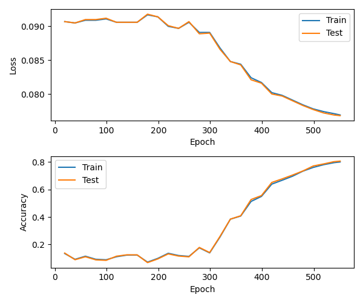

# Simulated Annealing with JAX

This project uses JAX to perform simulated annealing (SA) optimization and applies it to small neural networks with interesting and rather unusual features such as binary and trinary trainable parameters and step functions as activation functions.


## Simulated Annealing

The process of physical annealing is a heat treatment used in material science and metallurgy where a material is heated to the melting point before it is slowly cooled down until it solidifies. As the material slowly cools down, atoms migrate from an irregular order to form a regular crystal lattice accompanied by a decrease of defects in the material. With a decreasing number of dislocations in the material and thus a more ordered atomic structure, the total energy stored in the material decreases as well. 

In 1983, [Kirkpatrick et al.](https://www.science.org/doi/pdf/10.1126/science.220.4598.671), combined the insights of heating and cooling materials to change their physical properties with the Monte Carlo-based Metropolis-Hastings algorithm, to find approximate solutions to the traveling salesman problem. This combination led to the technique of simulated annealing and finds applications to problems in the field of discrete and continuous optimisation. It has been shown, that with a sufficiently high initial temperature and sufficiently long cooling time, the system's minimum-energy state is reached.

Simulated annealing starts with a high initial temperature allowing the optimization algorithm to explore the solution space and accepting transitions that degrade the objective function. The initial high temperature allows to explore a wide range of system states and helps to find globaly optimal solutions. The probability of transitioning momentarily to performance reducing solutions progressively decreases as the temperature slowly approaches a value of zero. Thus, as the temperature approaches zero, worse solutions are not accepted, and simulated annealing approaches a Monte Carlo algorithm behavior.

In a nutshell, simulated annealing selects at each iteration a randomly created candidate solution that is close to the current one under some distance metric. The system moves to the proposed solution either if it comes with lower costs or with a temperature-dependent probability. With decreasing temperature, the temperature-dependent probability to accept worse solutions narrows and the optimization focuses more and more on improving solutions.

> *As an aside, Metropolis-type algorithms accept worse solutions with a certaint probability to explore the solution space and find globaly optimal solutions to avoid getting stuck in local optima. This is in strong contrast to greedy Monte Carlo (local search) optimization algorithms, that only accept lower cost solutions.*

The following pseudocode shows simulated annealing for neural networks.

```python
def simulated_annealing(temp_initial: float, temp_final: float):
    temp = temp_initial

    params_old = init_params()      # Generate some initial random configuration
    params_best = params_old

    while temp > temp_final:
        params_new = neighbor_state(params_old)

        if loss(params_new) <= loss(params_old):
            params_old = params_new
            
            if loss(params_new) <= loss(params_best):
                params_best = params_new

        # Accept configuration associated with higher loss?
        elif exp((loss(params_old) - loss(params_new)) / temp) > random.random():
            params_old = params_new
            
        temp = schedule(temp)
```


## Continuous Optimisation

Even though simulated annealing is mainly used for combinatorial optimisation, it can be extended to continuous optimisation which is helpful when dealing with neural networks representing continuous functions with floating point weights.

[Corana et al.](https://dl.acm.org/doi/10.1145/29380.29864) extended simulated annealing to the continuous case by using a homogeneous annealing schedule. A homogeneous annealing schedule keeps the temperature constant until the system reaches an equilibrium state before the temperature is lowered by a small amount. In contrast, inhomogeneous annealing schedules reduce the temperature after each iteration.


## Methods

### Discrete Optimisation

Discrete steps of length $\{-1, 0, 1\}$ for every parameter dimension $\vec{\omega}$ are sampled uniformly at random followed $U \sim \mathcal{U}(\{-1, 0, 1\})$. The acceptance determines a random variable following a Bernoulli distribution $B \sim \mathcal{B}(p)$. Finally, a clamp function clamps the proposed step into the range $[a, b]$.

$$\omega'_{n+1} = \omega_n + u \cdot b$$

$$\omega_{n+1} = \max(\min(\omega_{n+1}', \omega_{\max}), \omega_{\min})$$


### Continuous Optimisation

Continuous steps of in the range of $[-\gamma, \gamma]$ are sampled from a uniform distribution $U \sim \mathcal{U}(-\gamma, \gamma)$ for every parameter dimension of the weight vector $\vec{\omega}$. Acceptance of proposed steps are determined by a random variable following a Bernoulli distribution $B \sim \mathcal{B}(p)$. Thus, the proposed change is computed as follows

$$\omega_{n+1} = \omega_n + \gamma \cdot u \cdot b$$


### Perturbation Probability

The previous two sections showed possible methods of taking discrete and continuous steps in parameter space. This section briefly discusses the perturbation probability $p
$, that determines the amount of parameters changed at each iteration.

This implementation couples the perturbation probability directly to the current temperature $T$ of the system leading to the following relation

$$p = p_0 \cdot \frac{T}{T_0}$$

with $p_0$ and $T_0$ representing the initial perturbation probability and initial temperature, respectively.


## Experiments

The following experiments tested simulated annealing for fully connected neural networks with discrete trainable parameters and used an inhomogeneous annealing schedule. The networks consisted of 3 hidden layers with 2048 neurons each. Networks were initialized randomly and identically when compared to different sets of optimization  parameterse. A good temperature found empirically was found to be $0.06$. The temperature schedule followed an exponential decay with $\gamma = 0.02$. The optimization stopped at a temperature of $1e-6$.

<p align="center">

</p>


## Discussion

Apart from the fact that one should probably not optimize neural networks with simulated annealing, it is fun to play around with JAX and neural wetworks with discrete weights. Despite the high dimensionality of the used neural network, an accuracy of over 80% was achieved.

Getting the hyperparameters right for simulated annealing is a bit cumbersome. It required quite a bit of trial and error to get the initial temperature as well as the annealing schedule right.

Another difficulty regarding the neural networks is the correct normalization of the network's predictions in case of discrete network parameters and step activation functions. It turns out that this is a crucial step before common loss functions can be meaningfully applied.


## Citation

```bibtex
@misc{Fischer2022deepa,
author={Fischer, Kai},
title={simulated-annealing-with-jax},
year={2022},
publisher = {GitHub},
journal = {GitHub repository},
howpublished={\url{https://github.com/kaifishr/DeepAnnealing}},
}
```


## License

MIT